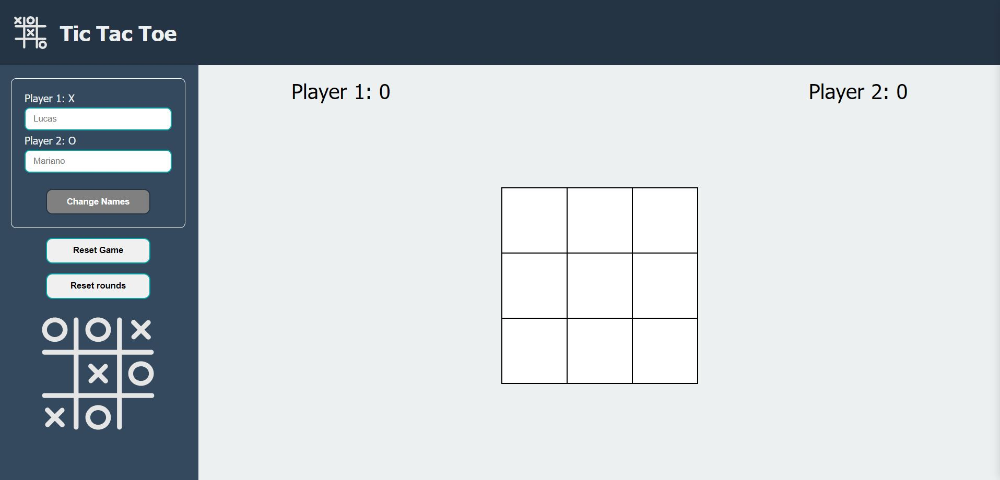
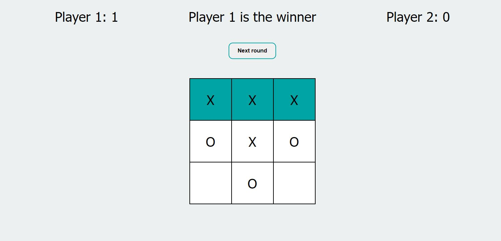
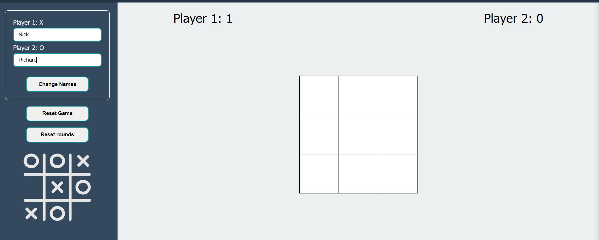
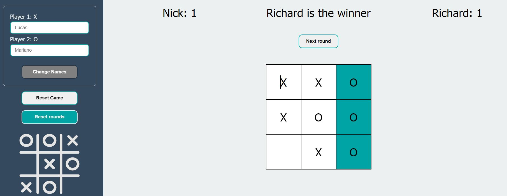
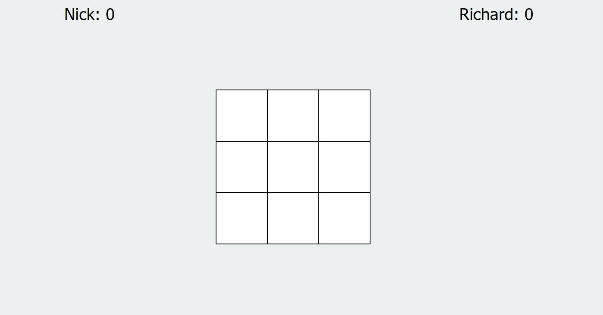
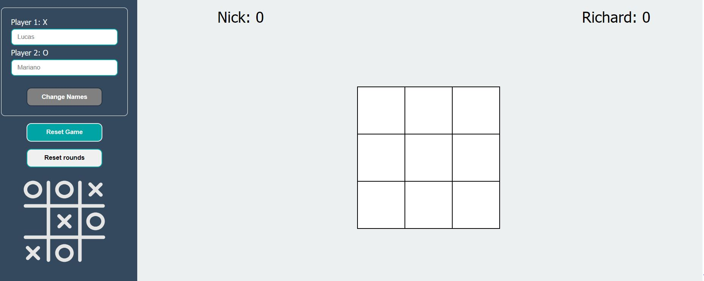

# Tic-tac-toe

A game project to play a two player tic-tac-toe

# What the project is about

A simple implementation of the classic Tic Tac Toe game with two players taking turns to mark 'X' and 'O' on a 3x3 grid. The game keeps track of players' scores, declares a winner for each round, and allows for multiple rounds.

# What have I learned so far?

This tic-tac-toe project introduced me to using modules and IIFE to abstract different sections of the app.

<ul>
  <li>Use of module pattern.</li>
  <li>Use of IIFE.</li>
  <li>Closures.</li>
  <li>App state management.</li>
  <li>Code modularity and split responsibility in functions.</li>
</ul>

# Want to see it in action?

<a href="https://hroglardev.github.io/Tic-tac-toe/" target="_blank">Click here</a>

# How to use the app.

Right from the start the app is fully functional. Player 1 plays "X" symbol and Player 2 plays "O".

When either player wins a round or there's a tie, the board becomes non functional and, if there was a winner, the winning line is highlighted. If you wish to play another round, click on the appearing button above the board indicating so.

If you wish to change the players' names, use the sidebar's form to choose them. The score won't be reset despite changing the names.

You can reset the score of both players by clicking the reset rounds button on the sidebar.

If you wish to completely reset the game to default values, make use of the reset game button above the previous reset rounds button.

# Want to track my progress?

Checkout my other projects in order to see my evolution:

<ol>
  <li><a href="https://github.com/hroglardev/odin-recipes" target="_blank">Recipes</a></li>
  <li><a href="https://github.com/hroglardev/Odin-landing-page" target="_blank">Landing Page</a></li>
  <li><a href="https://github.com/hroglardev/Rock-Paper-Scissors-TOP-Console" target="_blank">Console Rock, Paper, Scissors</a></li>
  <li><a href="https://github.com/hroglardev/Rock-Paper-Scissors-TOP" target="_blank">Rock, Paper, Scissors</a></li>
  <li><a href="https://github.com/hroglardev/Etch-a-Sketch" target="_blank">Etch a Sketch</a></li>
  <li><a href="https://github.com/hroglardev/Calculator" target="_blank">Calculator</a></li>
  <li><a href="https://github.com/hroglardev/Sign-up-form-TOP" target="_blank">Sign up form</a></li>
  <li><a href="https://github.com/hroglardev/Dashboard" target="_blank">Dashboard</a></li>
  <li><a href="https://github.com/hroglardev/Library" target="_blank">Library</a></li>
  <li><a href="https://github.com/hroglardev/Tic-tac-toe" target="_blank">You are here</a></li>
</ol>
